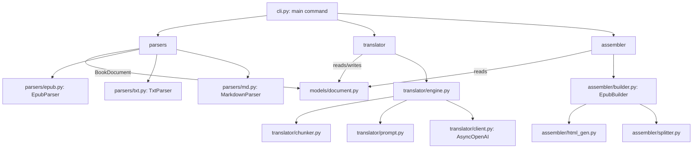

<!-- generated-by: gsd-doc-writer -->
# Architecture

## System Overview

`book-translator` is an AI-powered command-line tool that converts source ebooks
(EPUB, TXT, Markdown) into bilingual or monolingual EPUB output using an OpenAI-compatible
chat completion model. Its input is a single book file plus source/target language codes; its
output is a single EPUB written to a destination path. The system is organized as a linear
four-stage pipeline — **parse → translate → assemble → emit** — coordinated by a single
ephemeral CLI run. Every invocation creates a self-contained working directory under the system
temp location, performs all intermediate I/O there, copies the finished EPUB to the destination,
and (unless preservation is requested) deletes the working directory. A normalized in-memory
representation, the `BookDocument`, flows between every stage and is the single source of truth
that decouples parsers from the translator and the assembler.

## Component Diagram



Data flow direction (A → B): A produces or invokes B. The `parsers`, `translator`, and
`assembler` packages never call each other directly — `cli.py` is the sole orchestrator, and
`models/document.py` is the shared data contract between them.

## Data Flow

A typical run, driven by `main()` in `src/book_translator/cli.py`, moves a book through these
steps:

1. **Validation (pre-run).** The CLI validates the file suffix against
   `SUPPORTED_SUFFIXES` (`.epub`, `.txt`, `.md`, `.markdown`), confirms the file exists, and
   validates `--granularity` (`page` | `sentence`), `--mode` (`parallel` | `interactive` |
   `monolingual`), and granularity-scoped flags before any working directory is created.
2. **Run directory creation.** `tempfile.mkdtemp(prefix="book-translator-")` creates an
   ephemeral `job_dir` with `src/` and `dst/` subdirectories.
3. **Ingest.** The input file is copied into `job_dir/src/` so the run is self-contained.
4. **Parse.** `_parse_file()` dispatches on suffix to the matching parser. The parser returns a
   `BookDocument`, which is serialized to `job_dir/src/<stem>.json` via `BookDocument.to_json()`.
5. **Translate (async).** Depending on granularity, the CLI runs either `translate()` (page /
   paragraph level) or `translate_sentence()` (sentence level) from
   `translator/engine.py` under `asyncio.run()`. The engine reads the source JSON, groups
   translatable units into batches, calls the model concurrently (bounded by a semaphore), fills
   in translations, and writes `job_dir/dst/<name>.<target_lang>.json` atomically.
6. **Assemble.** Based on `--mode`, the CLI calls `assemble()`, `assemble_interactive()`, or
   `assemble_monolingual()` from the `assembler` package. These read the translated JSON, build
   an `epub.EpubBook` via `EpubBuilder`, and write an EPUB into `job_dir/dst/`.
7. **Emit.** The finished EPUB is moved/copied to the destination path
   (`_copy_or_move()`, atomic `os.replace` when possible). The default destination is
   `cwd/<stem>.<target_lang>.epub` with any trailing `.<source_lang>` token stripped from the
   stem.
8. **Cleanup.** In the `finally` block, the run directory is removed unless `--preserve-temp`
   or `--debug` was set (debug implies preserve). Cleanup failures on a successful run are
   downgraded to a warning so they do not fail the run.

## Key Abstractions

| Abstraction | Location | Description |
| --- | --- | --- |
| `BookDocument` / `Chapter` / `Paragraph` | `models/document.py` | Pydantic models forming the intermediate representation (IR) shared across all stages. `BookDocument.to_json()` / `from_json()` provide the on-disk JSON contract. |
| `Paragraph.kind` | `models/document.py` | Literal type tagging each unit as `paragraph`, `heading`, `caption`, `footnote`, `image`, or `table`; drives translatability and rendering decisions downstream. |
| `Parser` protocol | `parsers/__init__.py` | Structural `Protocol` — any object with `parse(Path) -> BookDocument` qualifies. Implemented by `EpubParser`, `TxtParser`, `MarkdownParser`. |
| `ParseError` | `parsers/__init__.py` | Raised for unrecoverable parse failures (e.g. DRM, unsafe ZIP entries, unsupported suffix). |
| `translate()` / `translate_sentence()` | `translator/engine.py` | Async entry points for page-level and sentence-level translation; orchestrate batching, concurrency, retries, and result writeback. |
| `TranslationBatch` / `SentenceChunk` / `SentenceBatch` / `BatchContext` | `translator/chunker.py` | Frozen dataclasses that group translatable units (and continuity context) into model-sized batches under a token budget. |
| `build_system_prompt()` / `build_user_message()` | `translator/prompt.py` | Construct the literary-translator system prompt and the JSON user payload; `TRANSLATION_RESPONSE_FORMAT` defines the strict JSON schema expected back. |
| `create_client()` | `translator/client.py` | Builds an `AsyncOpenAI` client with `max_retries=0` (retry/backoff is handled in the engine via `tenacity`). |
| `TranslationError` | `translator/exceptions.py` | Raised for unrecoverable translation failures. |
| `EpubBuilder` | `assembler/builder.py` | Builds `epub.EpubBook` objects in three layouts: `build()` (parallel pairs), `build_interactive()` (CSS-only `<details>`/`<summary>` toggles), `build_monolingual()` (translation only). |
| `build_pair_html()` / `build_interactive_html()` / `wrap_chapter_xhtml()` | `assembler/html_gen.py` | Render per-paragraph (or per-sentence) HTML and wrap chapter bodies into valid XHTML. |
| `split_chapter_parts()` | `assembler/splitter.py` | Splits large chapters into multiple XHTML files once a byte-size limit (default 300 KB) is exceeded, naming parts `chapter-NN-ptK.xhtml`. |

## Component Detail

### Parsers (`parsers/`)

Each parser converts a source format into a `BookDocument`. They are selected by file suffix in
`cli.py::_parse_file()` and imported lazily.

- **`EpubParser`** (`parsers/epub.py`): checks for DRM (`META-INF/encryption.xml`) and unsafe
  ZIP traversal entries, reads the spine via `ebooklib`, and walks each chapter's body with
  BeautifulSoup. `_walk()` flattens nested markup into leaf block paragraphs, mapping tags to
  `kind` via `TAG_TO_KIND` (headings, captions, images, tables). `_extract_blocks()` is the
  reusable block-extraction routine.
- **`TxtParser`** (`parsers/txt.py`): splits on horizontal-rule lines (`---`, `***`, `___`)
  into chapters and on blank-line runs into paragraphs; wraps each block in `<p>` for `raw_html`.
- **`MarkdownParser`** (`parsers/md.py`): renders Markdown to HTML (`tables` extension), then
  reuses `epub._extract_blocks()`. If the document contains any `<h1>`, each `<h1>` starts a new
  chapter; otherwise the whole document is a single chapter.

### Translator (`translator/`)

The translator reads the source JSON, builds batches, and calls the model concurrently.

- **`engine.py`** orchestrates everything. `translate()` handles page/paragraph granularity;
  `translate_sentence()` handles sentence granularity. Both use an `asyncio.Semaphore` to bound
  concurrency and `tenacity.AsyncRetrying` for retries — retrying only on retryable errors
  (`RateLimitError`, `APIConnectionError`, and 5xx `APIStatusError`) with exponential backoff and
  jitter. Non-retryable 4xx errors (401/403/400) propagate to the CLI. Units that ultimately fail
  are written as the literal `[TRANSLATION FAILED]`. Results are persisted with an atomic
  temp-file + `os.replace` write (`_write_translated()`).
- **`chunker.py`** builds batches. `build_translation_batches()` groups translatable paragraphs
  per chapter under a token budget (`DEFAULT_CONTEXT_TOKEN_BUDGET`, scaled by
  `TARGET_CONTEXT_UTILIZATION`), flushing at chapter boundaries and section starts. For sentence
  mode, `build_sentence_chunks()` uses an NLTK Punkt tokenizer to split paragraphs into sentence
  chunks (headings are never split; short sentences of ≤4 words merge; max 3 sentences per chunk),
  and `build_sentence_batches()` groups those chunks under a token budget. `build_batch_context()`
  supplies preceding-paragraph or heading context for continuity.
- **`prompt.py`** defines the system prompt (a "professional literary translator" persona) and
  serializes the user payload as compact JSON. `TRANSLATION_RESPONSE_FORMAT` is a strict
  `json_schema` describing the expected `{"translations": [{"id", "text"}]}` response.
- **`client.py`** wraps `AsyncOpenAI` with `max_retries=0`; an optional `base_url` allows pointing
  at any OpenAI-compatible endpoint.

### Assembler (`assembler/`)

The assembler turns the translated `BookDocument` back into an EPUB.

- **`__init__.py`** exposes `assemble`, `assemble_interactive`, and `assemble_monolingual`. Each
  expects exactly one `*.json` in `job_dir/dst/`, delegates EPUB construction to `EpubBuilder`, and
  writes the EPUB atomically (temp file + `os.replace`).
- **`builder.py`** (`EpubBuilder`) builds the `EpubBook`: sets metadata and language, adds NCX/Nav
  and a CSS item, then renders each chapter into one or more XHTML items, building the spine and
  table of contents. Three layouts are supported: parallel pairs (`build`), interactive CSS-only
  `<details>` toggles with `_INTERACTIVE_CSS` (`build_interactive`), and translation-only
  (`build_monolingual`).
- **`html_gen.py`** produces the per-unit HTML. `build_pair_html()` emits target-first
  `bt-pair` blocks (and per-sentence pairs when `sentence_translations` is present);
  `build_interactive_html()` emits `<details>`/`<summary>` blocks; image/table kinds pass through
  unchanged. `_prefix_ids()` namespaces source-HTML ids to avoid collisions, and
  `wrap_chapter_xhtml()` wraps bodies in an XHTML5 template linking the shared stylesheet.
- **`splitter.py`** (`split_chapter_parts()`) keeps individual XHTML files under a byte limit by
  splitting oversized chapters into `chapter-NN-ptK.xhtml` parts, always emitting at least one part
  for title-only chapters.

## Directory Structure Rationale

The package lives under `src/book_translator/` (a src-layout package built with Hatchling). The
top-level structure mirrors the pipeline stages so each concern is isolated and independently
testable:

```
src/book_translator/
├── cli.py            # Typer CLI: orchestrates the full parse→translate→assemble→emit run
├── models/
│   └── document.py   # Pydantic IR (BookDocument/Chapter/Paragraph) — the shared data contract
├── parsers/          # Input adapters: EPUB / TXT / Markdown → BookDocument
│   ├── epub.py
│   ├── txt.py
│   └── md.py
├── translator/       # Async translation: batching, prompting, OpenAI client, retries
│   ├── engine.py
│   ├── chunker.py
│   ├── prompt.py
│   ├── client.py
│   └── exceptions.py
└── assembler/        # Output generation: BookDocument → EPUB
    ├── builder.py
    ├── html_gen.py
    └── splitter.py
```

- **`models/`** holds the IR so parsers and the assembler depend only on a stable data shape, not
  on each other.
- **`parsers/`** isolates each input format behind the `Parser` protocol, making new formats
  additive.
- **`translator/`** separates orchestration (`engine`), batching policy (`chunker`), prompt
  construction (`prompt`), and transport (`client`) so model/prompt changes do not touch I/O.
- **`assembler/`** separates EPUB structure (`builder`), HTML rendering (`html_gen`), and
  size-based splitting (`splitter`).
- **`cli.py`** is intentionally the only module that wires the stages together and owns the
  ephemeral run lifecycle, keeping the pipeline packages decoupled.
